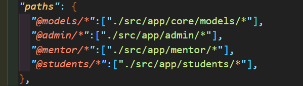
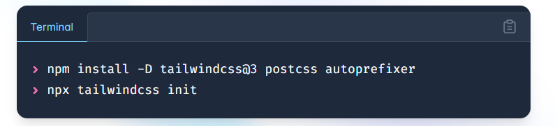
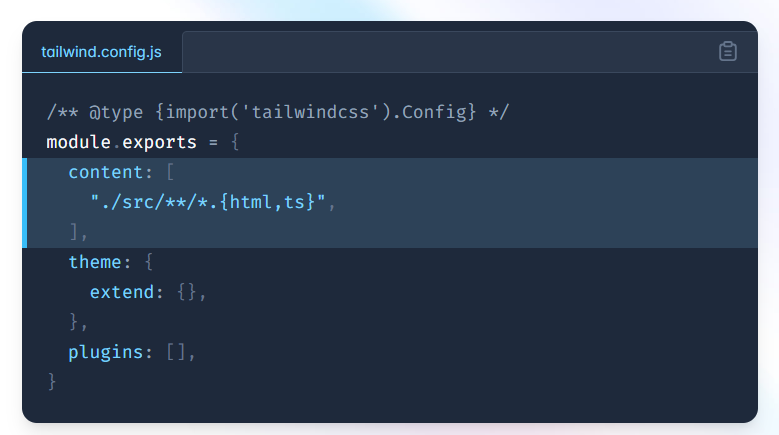
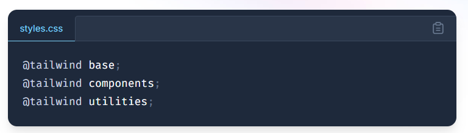
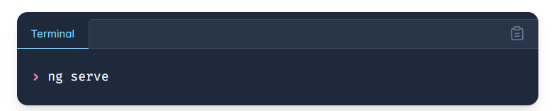

### FRONTEND (JS & TS ANGULAR) KURS
### 23 - dars. (Mavzulari).
### ANGULAR DARS-5.

### loyiha

```
npm install -g @angular/cli         (install angular cli)
ng version                          (check version)
ng new vector-it-academy --minimal  (create project with minimal)
cd vector-it-academy                (go to project section)
npm run start                       (start project)
ng add @angular/material            (add angular material) & (npm i @angular/material)
```

- components
1. admin.
2. mentor.
3. students.

### Aleases For import
- tsconfig.json


- add toolbar
https://material.angular.dev/components/toolbar/overview

- add tailwind css
- https://v3.tailwindcss.com/docs/guides/angular




